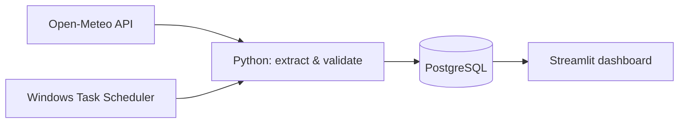

<h1 align="center">Hi, I'm Pradip Neupane 👋</h1>

<strong>Turning API data into reliable pipelines and useful analytics.</strong>

MSc Data Science · Tampere University Targeting data engineering internships and junior data engineer roles

  <a href="https://github.com/Neupane-pradip/weather-data-pipeline">🌦️ Weather Pipeline</a> ·
  <a href="https://github.com/Neupane-pradip/fpl-analytics-elt">⚽ FPL Analytics</a> ·
  <a href="mailto:pradip.neupane@tuni.fi">✉️ Contact</a>

  
  
  
  
  

---

## Building toward data engineering

I'm a master's student in Data Science at Tampere University, with my first semester completed. My background combines software development and mathematics.

I learn by building projects from source to dashboard: extracting API data, modeling SQL tables, checking data quality, handling failures, and explaining the results. My current focus is Python, SQL, ETL/ELT, and reliable scheduled collection.

## Featured work

| Project | What it demonstrates | Explore |
|---|---|---|
| **Weather Data Pipeline** | Multi-city ETL, PostgreSQL storage, API retries, scheduling, and a Streamlit dashboard | [Repository](https://github.com/Neupane-pradip/weather-data-pipeline) |
| **FPL Analytics ELT** | API staging in DuckDB, dimensional modeling, SQL transformations, and data quality assertions | [Repository](https://github.com/Neupane-pradip/fpl-analytics-elt) |
| **Titanic Survival Prediction** | Preprocessing, model comparison, evaluation, and visualizations | [Repository](https://github.com/Neupane-pradip/-Titanic-Survival-Prediction) |

### 🌦️ Weather Data Pipeline — from API to dashboard

**Three cities · 15-minute local schedule · Historical temperature records**

- **Useful data:** current temperatures for Helsinki, London, and Berlin become timestamped records and trend charts.
- **Safe reruns:** a database unique constraint prevents duplicate city–time–source records.
- **Failure handling:** bounded API retries, per-city exceptions, logs, and a test that simulates a temporary server failure.

[Read the architecture, setup, and design decisions →](https://github.com/Neupane-pradip/weather-data-pipeline#readme)

### ⚽ FPL Analytics ELT — from raw data to an analytics model

**Python · DuckDB · Pandas · SQL**

Stages Fantasy Premier League API data and builds player, team, and gameweek dimensions alongside a player-statistics fact table. SQL checks cover duplicate keys, missing values, orphaned team references, and invalid numeric ranges.

[Explore the SQL model →](https://github.com/Neupane-pradip/fpl-analytics-elt/blob/main/sql/02_star_schema.sql) · [Explore the quality checks →](https://github.com/Neupane-pradip/fpl-analytics-elt/blob/main/src/data_quality.py)

## Skills in practice

| Area | What I'm applying |
|---|---|
| **Python & SQL** | Reusable functions, API requests, queries, and transformations |
| **Data engineering** | ETL/ELT, multi-city batches, scheduled collection, and dimensional modeling |
| **Storage** | PostgreSQL, DuckDB, typed schemas, and unique constraints |
| **Reliability** | Validation, logging, retries, exception handling, and automated testing |
| **Analytics** | Pandas, Streamlit, and temperature history visualization |
| **Development** | Git/GitHub, virtual environments, and environment-based configuration |

## Next learning goals

- Historical backfills and incremental loading
- Broader test coverage and continuous integration
- Reproducible environments and deployment

I add new tools to this profile as I use them in projects and can explain the decisions behind them.

## Education

🎓 **MSc in Data Science — Tampere University**  
In progress · First semester completed · Expected graduation: December 2027

🎓 **BSc in Computing Science and Electrical Engineering**  
Completed · Major: Software Development · Minor: Mathematics

## Let's connect

I'm interested in data engineering internships, junior roles, and feedback on my projects.

**[pradip.neupane@tuni.fi](mailto:pradip.neupane@tuni.fi)**
